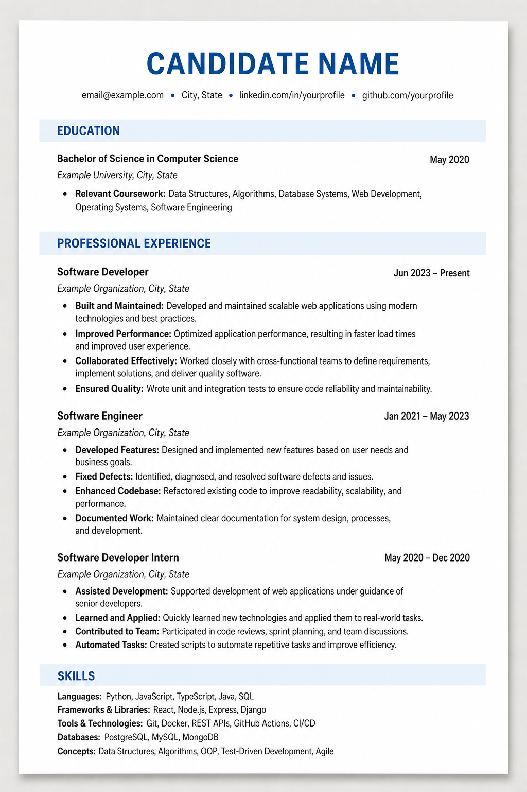

# CV Editing Skill

A Codex skill for tailoring a truthful, achievement-focused CV or resume to a job description (JD).

CV Editing turns a JD and the candidate’s verified experience into a concise, recruiter-readable CV. It maps evidence to the role, uses STAR reasoning without bloated prose, ranks the most relevant work first, and then checks the final document for two-page fit, professional natural language, repetition, and layout quality. If no prior CV exists, it starts with a focused interview so that the draft is based on real achievements rather than assumptions.

It helps you:

- map experience and language to the JD without inventing qualifications;
- rewrite experience using a compact STAR model;
- format every experience bullet as **Summary phrase:** action, scope, and result;
- prioritize roles and bullets by relevance;
- apply a clean, one-column professional layout;
- run a final check for a two-page limit, professional language, natural JD alignment, and repetitive phrasing.

## Preview



The preview contains only fictional placeholder information.

## Install

1. Download the latest skill ZIP from this repository, or copy this `cv-editing` folder.
2. Extract it.
3. Copy the `cv-editing` folder into your Codex skills directory:

   ```text
   $CODEX_HOME/skills
   ```

   If `CODEX_HOME` is not configured, use:

   ```text
   ~/.codex/skills
   ```

4. Restart or reload Codex if necessary.
5. Invoke it with a request such as:

   ```text
   Use $cv-editing to tailor my CV to this job description.
   ```

## Usage notes

The workflow has three phases:

1. Provide the JD and, if available, a current CV. If the CV is absent or incomplete, answer a short interview about relevant roles, achievement stories, skills, verified metrics, and constraints.
2. Review the generated CV, which is tailored to the JD, formatted, and checked for page count, professional language, repetition, and layout quality.
3. Give feedback on content, wording, ordering, or layout; the skill makes a scoped revision and re-runs the affected checks.

The skill preserves factual dates, titles, employers, metrics, and scope. When a fact is missing, it asks for it or leaves a placeholder rather than inventing an accomplishment.

The supplied layout is single-column and ATS-friendly. For the full layout rules, see [references/layout.md](references/layout.md); for the pre-delivery quality check, see [references/quality-check.md](references/quality-check.md).

## Public-release safety

This package contains only skill guidance, a YAML interface file, and an anonymous preview image—no executable code, credentials, real CV, JD, or candidate information. The included `.gitignore` excludes common secret files and candidate-provided source documents. Run the checklist in [SECURITY.md](SECURITY.md) before every public release.

## Disclaimer

Use of this skill is subject to [DISCLAIMER.md](DISCLAIMER.md). The user remains responsible for the truthfulness of the CV and for reviewing the final document before submission; the skill does not guarantee an interview or offer.
